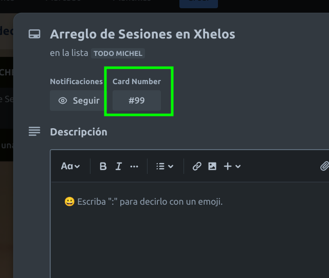

# Xhelos - Tactical Creature Game V0.9.2

## Descripción Readme V0.1
Xhelos es nuestro proyecto para un juego web de estrategia y tactica, enfocado en impedir el Pay2Win o el efecto  [efecto ultralisk](http://taurencreate.blogspot.com/2008/11/el-arte-de-la-estrategia-el-factor.html). 

Tambien para una idea de los stats de los personajes aqui tenemos una idea [de como funciona.](http://taurencreate.blogspot.com/2009/08/un-modelo-de-ataque-y-defensa-en-juegos.html)

## Estructura del Proyecto
El proyecto consta de 2 subproyectos. 
1) La pagina web del juego creada en Drupal6 y que proximamente moveremos a la version a Wordpress en la carpeta raiz.
2) El juego en si dentro de la carpeta /game

Actualmente los usuarios se registran a traves de la pagina web pero vamos a cambiar eso para que el juego
tenga su propio sistema de Login. Despues de eso mejoraremos la seguridad del Login para evitar todo
tipo de ataque a su seguridad, incluyendo un sistema ReCaptcha.

## Forma de Trabajo con Git
Como vamos a trabajar en equipo con GIT nuestro branch main sera donde se guarde la versión live del juego. Esta no se debe de usar hasta que estemos seguros que queremos deployar codigo ya probado. Nosotros trabajaremos en equipo trabajando en nuestro propio branch basado en el branch develop. Una ves que terminemos nuestro codigo lo subimos al repositorio en su propio branch  hacemos un pull request a develop.

*** Lista de Branchs ***
- **main:** Branch principal para subirlo a Live
- **staging:** Branch para hacer prepruebas antes de subirlo a Live
- **develop:** Nuestro Branch principal de trabajo, aqui mezclaremos todos nuestros desarrollos
- **feat_##_nombredelamejora:** Branch de trabajo para cuando queramos añadir algo nuevo. Por ejemplo feat_04_mejoradelogin. El numero esta asociado a la tarjeta en Trello del proyecto.
- **bug_##_nombredelbug:** Branch de trabajo para cuando queramos arreglar un problema. Por ejemplo bug_11_arreglosesiones. El numero estara asociado a la tarjeta de Trello del proyecto. 



## Instalación

Si lo estas copiando desde cero tan solo:

### 0) Sugerencia - Trabajemos con Lando y Linux Mint
Lando es una herramienta que nos permite instanciar rapidamente un servidor para este videojuego. 
LinuxMint es una version Open Source de Linux muy estable e ideal para trabajar en desarrollo. Mucho
mejor que Ubuntu dada las limitaciones que da Ubuntu al momento de instalar sofware en sus sistemas.

### 1) Obten el repositorio de GitHub
Usamos github para controlar el desarrollo del juego.
```
cd existing_repo
git clone https://github.com/almaquinta/xhelos.git
git branch main
```

### 2) Instalar la receta de lando
La receta viene instalada con PHP 7.4, mysql 5.7, xdebug2 y phpmyadmin. Si no tuvieras lando por ahora usa este stack
tecnologico. A futuro migraremos el juego a PHP 8.X y Mysql 8.X

En caso de usar lando en la raiz del sitio ejecutar:
```
lando install
```

### 3) Instala las 2 bases de datos
Existe la base de datos de Drupal llamada drupal7, usuario drupal7 y password drupal7, por defecto en lando se usa el server database pero en caso usen Wamp usen localhost. Esto se configura en el archivo /sites/default/settings.php.

La base de datos del juego se llama xhelos, usuario xhelos y password xhelos. Esto se configura en /games/lib/include.php

Pueden usar phpmyadmin por ahora o ejecutar lando para subir la base de datos de la pagina web con el comando.

```
lando db-import drupal7.sql
```

Para el juego no se puede ejecutar directamente db-import, primero tienes que crear el usuario xhelos, con password xhelos y aplicarlos a una nueva base de datos llamada xhelos, despues de eso importarlo. Sugiero usar directamente phpmyadmin.

Muy importante, lando usa por defecto la nombre de servidor **database** en lugar de **localhost** como hace Wamp o Xamp. Cuando vayan a crear el usuario y darle todos los permisos asegurense de darle los permisos adecuados para todo tipo de servidor y no solo para localhost o database. Es mejor asegurarse. 

### 4) Probar el juego
Ya debe de estar todo instalado asi que queda continuar nomas. Entren a la dirección de su servidor local. La [web en drupal6](https://4xhelos.lndo.site/) o al [demo del juego](https://4xhelos.lndo.site/game/region.php) del juego para probarlo. Estas direcciónes son de Lando. Si estan usando Wamp o similares lo mas seguro es que tengan que cambiar a localhost/nombredelacarpeta donde este puesto su juego. No es lo ideal. 

## Autores y reconocimiento
Lider del Proyecto y Game Designer - Jose Carlos Tamayo
Lider de Equipo - Daniel
FrontEnd y Design - Daniel Tysoc


## Licencia
Para proyectos de código abierto, indica cómo está licenciado.

## Estado del proyecto
Si te has quedado sin energía o tiempo para tu proyecto, pon una nota al principio del README diciendo que el desarrollo se ha ralentizado o se ha detenido por completo. Alguien podría elegir bifurcar tu proyecto o ofrecerse como mantenedor o propietario, permitiendo que tu proyecto siga adelante. También puedes hacer una solicitud explícita de mantenedores.

